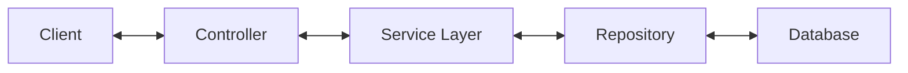

# 💰 Expense Tracker API

is a secure and scalable RESTful API that allows users to track, manage, and analyze their personal expenses. Built with performance and security in mind using Spring Boot and JWT Authentication.
The project focuses on clean backend architecture, security, and real-world business logic .


## 🚀 Key Features

* **🔐 Secure Authentication:** Full Role-Based Access Control (RBAC) using JWT (JSON Web Tokens).
* **📊 Expense Management:** Create, Read, Update, and Delete (CRUD) personal expenses.
* **📈 Smart Analytics:** Get spending summaries grouped by category.
* **📥 Data Export:** Download expense reports directly as **CSV files** for Excel/Sheets.
* **⚡ Efficient Data Access:** Optimized database queries using **Spring Data JPA** & **Hibernate**.
* **📄 API Documentation:** Fully documented with Swagger UI & OpenAPI.

## 🛠️ Tech Stack

* **Core Framework:** Spring Boot 3, Java 17
* **Database & ORM:** PostgreSQL, Spring Data JPA, Hibernate
* **Utilities:** Lombok 
* **Security:** Spring Security, JWT (jjwt library)

## 🏗️ Architecture & Design

The application follows a **Layered Architecture** based on the **MVC** pattern, promoting separation of concerns and maintainability.

### 🔄 Data Flow



```text
src/main/java/com/expensetracker
├── 🌐 controller   → API Layer: Handles HTTP requests & input validation.
├── 🧠 service      → Business Layer: Core logic & data processing.
├── 💾 repository   → Data Layer: Interfaces with PostgreSQL (Spring Data JPA).
├── 📦 entity       → Domain Model: Database tables mapped via Hibernate.
├── 📨 dto          → DTOs: Secure data transfer objects (decoupling API from Entity).
├── 🛡️ config       → Config: JWT filters, Authentication Managers, and Config.
└── ⚠️ exception    → Error Handling: Global advice for standardized API errors.
```
## 📦 How to Run

Follow these steps to get the application running on your local machine.

### Prerequisites
- Java 17 or higher
- Maven (Apache Maven 3.6+)
- PostgreSQL (installed locally or via cloud provider)

### Step 1 — Clone the repository
```bash
git clone https://github.com/hamsahesham66/Expense-Tracker-API.git
cd Expense-Tracker-API
```

### Step 2 — Configure the database
Create a PostgreSQL database named `expense_tracker`, then update connection details in:
`src/main/resources/application.properties`

Example:
```properties
spring.datasource.url=jdbc:postgresql://localhost:5432/expense_tracker
spring.datasource.username=postgres
spring.datasource.password=YOUR_ACTUAL_PASSWORD_HERE
spring.jpa.hibernate.ddl-auto=update
```

> Tip: For tests use `src/test/resources/application-test.properties` with an in-memory H2 DB.

### Step 3 — Run the application
From the project root:
```bash
./mvnw spring-boot:run
# or
mvn spring-boot:run
```
### Step 4 — Verify it works
- Swagger UI: http://localhost:8080/swagger-ui/index.html
- Example protected endpoint: use the `/api/v1/auth/authenticate` token then call `/api/v1/expenses`


## 👤 Author
Hamsa Hesham  
- GitHub: https://github.com/hamsahesham66  
- Email: h.hamssa66@gmail.com
